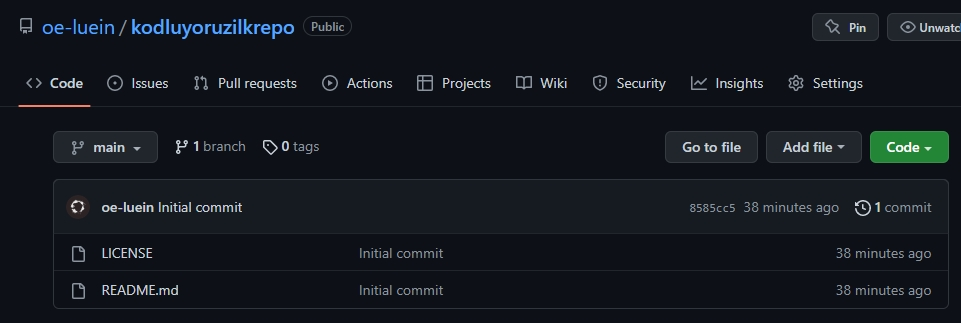

# Kodluyoruz İlk Repo

Bu repo, [Kodluyoruz](https://www.kodluyoruz.org/) Front-End eğitiminde oluşturduğumuz ilk repo. İçerisinde bir adet README.md dosyası, bir adet index.html dosyası ve son olarak img dizininde bir adet jpg uzantılı görsel bulunmaktadır.



## Installation

Öncelikle projeyi clone'layın.

`git clone https://github.com/oe-luein/kodluyoruzilkrepo.git`

## Usage

Projeyi clone'ladıktan sonra Visual Studio Code programında açınız.

Linux için:

```
cd kodluyoruzilkrepo
code .
```

## Contributing

Pull requestler kabul edilir. Büyük değişiklikler için, lütfen önce neyi değiştirmek istediğinizi tartışmak için bir konu açınız.

## License

[MIT](https://choosealicense.com/licenses/mit/)